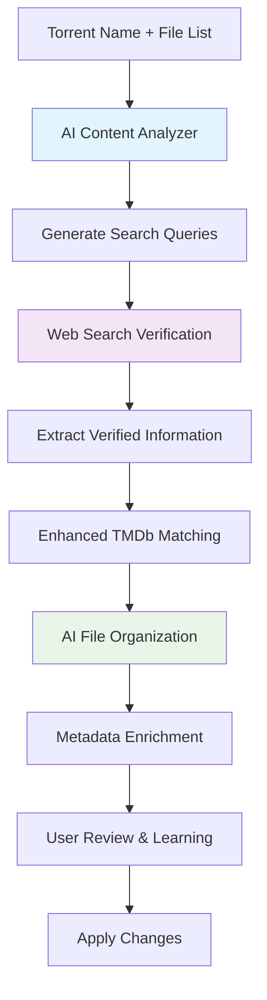

# PRP: AI-Powered Content Recognition & Intelligent File Management for Torrent Vibe

## Executive Summary

This PRP outlines the integration of advanced AI capabilities using Vercel AI SDK, web search tools, and TMDb API to create an intelligent content recognition and automated file management system for Torrent Vibe. This feature will transform the torrent client from a basic download manager into a fully AI-driven media management platform with sophisticated content identification, intelligent file organization, and automated metadata enrichment capabilities.

## Business Context & Motivation

### Current Market Gap
- Existing torrent clients provide basic file management without intelligent content understanding
- Complex torrent names with encoded information are difficult to parse accurately
- Users manually organize and identify downloaded content, wasting significant time
- No automatic metadata enrichment or intelligent file organization
- Poor success rate in matching content due to inconsistent naming conventions
- Lack of AI-driven insights for content management and organization

### Proposed AI-Enhanced Value Proposition
- **Advanced AI Content Analysis**: Multi-modal AI analysis of torrent names and file structures
- **Web Search Verification**: AI-powered web search to verify and enhance content identification
- **Intelligent TMDb Matching**: Smart matching using verified information from multiple sources
- **Automated File Management**: AI-driven file organization, renaming, and directory structuring
- **Smart Metadata Enrichment**: Comprehensive metadata scraping with intelligent prioritization
- **Learning System**: Continuous improvement through user feedback and pattern recognition
- **Batch Processing**: Intelligent bulk organization of existing media libraries

## Technical Architecture

### 1. AI-Enhanced System Architecture

```
┌─────────────────────────────────────────────────────────────────┐
│                      Torrent Vibe UI Layer                      │
├─────────────────────────────────────────────────────────────────┤
│  AI Metadata Cards  │  Smart Settings  │  Enhanced TorrentTable │
├─────────────────────────────────────────────────────────────────┤
│                  AI Content Recognition Service                  │
├─────────────────────────────────────────────────────────────────┤
│    AI Analyzer     │  Web Search Tool  │  Smart File Manager    │
├─────────────────────────────────────────────────────────────────┤
│  Content Verifier  │  TMDb Matcher     │  Metadata Enricher     │
├─────────────────────────────────────────────────────────────────┤
│    Vercel AI SDK   │   Learning Engine │   Cache & Queue        │
├─────────────────────────────────────────────────────────────────┤
│                         External Services                        │
│  OpenAI/Claude API │  Web Search API   │   TMDb API v3          │
└─────────────────────────────────────────────────────────────────┘
```

### 2. AI-Driven Content Identification Workflow



### 3. AI-Powered Core Components

#### 3.1 AI Content Analyzer (Vercel AI SDK Integration)
**Purpose**: Advanced AI-powered analysis of torrent names and file structures using LLM capabilities

**Key Features**:
- **Multi-Modal Analysis**: Process torrent names, file lists, and directory structures
- **Context Understanding**: Understand complex naming patterns and encoded information
- **Intelligent Extraction**: Extract title, year, quality, episode info with high accuracy
- **Ambiguity Resolution**: Handle unclear or non-standard naming conventions
- **Confidence Scoring**: Provide reliability metrics for all extracted information

**AI Implementation**:
```typescript
interface AIContentAnalyzer {
  analyzeContent(torrentName: string, fileList?: string[]): Promise<ContentAnalysis>
  generateSearchQueries(analysis: ContentAnalysis): Promise<string[]>
  validateAnalysis(analysis: ContentAnalysis, webResults: WebSearchResult[]): Promise<VerifiedContent>
}

// Using Vercel AI SDK
const analyzer = generateObject({
  model: openai('gpt-4-turbo'),
  schema: contentAnalysisSchema,
  prompt: createAnalysisPrompt(torrentData)
})
```

#### 3.2 Web Search Verification Engine
**Purpose**: Validate and enhance AI analysis results through intelligent web search

**Capabilities**:
- **Multi-Query Strategy**: Generate and execute multiple search queries
- **Result Synthesis**: Combine information from multiple sources
- **Fact Verification**: Cross-reference details across search results
- **IMDB/TMDb ID Extraction**: Extract official database IDs from search results
- **Alternative Title Discovery**: Find official and alternative titles

**Search Strategy**:
- IMDb/TMDb specific searches for official information
- General web search for confirmation and additional details
- Release-specific searches for quality and version information
- Cross-language searches for international content

#### 3.3 Enhanced TMDb Matching System
**Purpose**: Intelligent TMDb API integration with AI-enhanced matching

**Advanced Features**:
- **Multi-Strategy Search**: Use exact titles, alternative titles, and IDs
- **AI Match Evaluation**: LLM-powered evaluation of search results
- **Confidence Scoring**: Sophisticated scoring based on multiple factors
- **Fallback Mechanisms**: Handle edge cases and missing information
- **Batch Processing**: Efficient handling of multiple content items

**Matching Pipeline**:
1. Exact title + year matching
2. Alternative title search
3. IMDB/TMDb ID direct lookup  
4. Fuzzy title matching with AI evaluation
5. Manual review queue for low-confidence matches

#### 3.4 AI-Driven File Management System
**Purpose**: Intelligent file organization, renaming, and directory management

**Core Capabilities**:
- **Smart Directory Structure**: AI-generated optimal folder organization
- **Intelligent Renaming**: Context-aware file naming following best practices
- **Subtitle Management**: Automatic subtitle file organization and naming
- **Extras Handling**: Proper organization of bonus content and extras
- **Batch Operations**: Efficient bulk file management with progress tracking

**AI File Organization**:
```typescript
interface AIFileManager {
  generateFileStructure(content: ClassifiedContent, files: TorrentFile[]): Promise<FileStructure>
  createRenamingPlan(files: TorrentFile[], metadata: TMDbMetadata): Promise<RenamingPlan>  
  validateOperations(plan: FileOperationPlan): Promise<ValidationResult>
  executeOperations(plan: FileOperationPlan): Promise<ExecutionResult>
}

// Example AI-generated structure
const structure = await generateObject({
  model: openai('gpt-4'),
  prompt: createFileOrganizationPrompt(content, files),
  schema: fileStructureSchema
})
```

### 4. Enhanced Data Models & AI Interfaces

#### 4.1 AI Content Analysis Result
```typescript
interface AIContentAnalysis {
  // Core content information
  title: string                    // AI-extracted clean title
  alternativeTitles: string[]      // Possible alternative titles
  originalTitle?: string           // Original language title
  year?: number                    // Release year
  
  // Series information
  season?: number                  // TV season number
  episode?: number                 // Episode number
  episodeRange?: [number, number]  // Episode range for packs
  totalEpisodes?: number           // Total episodes in season/series
  
  // Content classification
  type: 'movie' | 'tv' | 'anime' | 'documentary' | 'miniseries' | 'special' | 'unknown'
  genre: string[]                  // AI-predicted genres
  
  // Technical details
  quality: {
    resolution?: string            // 4K, 1080p, 720p, etc.
    source?: string               // BluRay, WEB-DL, HDTV, CAM, etc.
    codec?: string                // x264, x265, AV1, etc.
    audio?: string                // DTS, AC3, AAC, Atmos, etc.
    hdr?: boolean                 // HDR content flag
    dolbyVision?: boolean         // Dolby Vision flag
    bitrate?: string              // Estimated bitrate
  }
  
  // Additional metadata
  language?: string               // Content language
  subtitles?: string[]            // Available subtitle languages
  releaseGroup?: string           // Release group name
  isRepack?: boolean             // Repack indicator
  isProper?: boolean             // Proper release indicator
  
  // AI confidence and reasoning
  confidence: number              // Overall analysis confidence (0-1)
  reasoning: string               // AI explanation of analysis
  uncertainties: string[]         // Areas of uncertainty
  suggestedQueries: string[]      // Web search queries to verify
}
```

#### 4.2 Web Search Verification Result
```typescript
interface WebSearchVerification {
  // Verified information
  officialTitle: string           // Confirmed official title
  alternativeTitles: string[]     // Found alternative titles
  releaseYear: number             // Confirmed release year
  
  // External IDs
  imdbId?: string                 // IMDb identifier
  tmdbId?: number                 // TMDb identifier  
  tvdbId?: number                 // TVDB identifier
  
  // Detailed information
  director?: string               // Director name
  cast?: string[]                 // Main cast members
  genres: string[]                // Verified genres
  plot?: string                   // Plot summary
  
  // Series-specific
  totalSeasons?: number           // Total seasons for TV shows
  episodeCount?: number           // Episode count for current season
  network?: string                // Original network/platform
  
  // Verification metadata
  confidence: number              // Verification confidence
  sources: string[]               // Information sources
  conflictingInfo: string[]       // Contradictory information found
}
```

#### 4.3 AI File Organization Plan
```typescript
interface AIFileOrganizationPlan {
  // Directory structure
  baseStructure: {
    movies: string                 // Movies base path
    tvShows: string               // TV shows base path
    anime: string                 // Anime base path
    documentaries: string         // Documentaries base path
  }
  
  // Content-specific organization
  contentPath: string             // Full path for this content
  
  // File operations
  fileOperations: Array<{
    currentPath: string           // Current file path
    newPath: string              // Proposed new path
    operation: 'move' | 'rename' | 'copy'
    fileType: 'video' | 'subtitle' | 'extra' | 'metadata'
    reasoning: string            // AI reasoning for this operation
    confidence: number           // Operation confidence
  }>
  
  // Metadata operations
  metadataOperations: Array<{
    filePath: string             // Target file path
    metadataType: 'nfo' | 'poster' | 'fanart' | 'banner'
    source: string               // Metadata source URL
    reasoning: string            // Why this metadata is needed
  }>
  
  // Quality assessment
  qualityCheck: {
    duplicates: Array<{          // Potential duplicate files
      files: string[]
      recommendation: 'keep_best' | 'keep_all' | 'manual_review'
    }>
    incomplete: string[]         // Potentially incomplete files
    corrupted: string[]          // Potentially corrupted files
  }
  
  // User preferences integration
  userPreferences: {
    namingScheme: string         // User's preferred naming scheme
    folderStructure: string      // User's preferred folder structure
    qualityPriority: string[]    // User's quality preferences
  }
}
```

#### 3.2 TMDb Match Result
```typescript
interface TMDbMatch {
  id: number                      // TMDb ID
  type: 'movie' | 'tv'           // Content type
  title: string                   // Display title
  originalTitle: string           // Original title
  year: number                    // Release year
  overview: string                // Plot summary
  posterPath: string | null       // Poster image path
  backdropPath: string | null     // Backdrop image path
  voteAverage: number             // TMDb rating
  genres: string[]                // Genre list
  matchScore: number              // Matching confidence (0-1)
}
```

#### 3.3 Classified Content
```typescript
interface ClassifiedContent {
  parsedInfo: ParsedMediaInfo     // Parsed torrent information
  tmdbMatch: TMDbMatch | null     // Best TMDb match
  confidence: number              // Overall confidence
  suggestions: TMDbMatch[]        // Alternative matches
  timestamp: Date                 // Classification timestamp
  userOverride?: TMDbMatch        // User-selected override
}
```

## AI-Enhanced Implementation Strategy

### Phase 1: AI Foundation & Core Services (Week 1-2)
1. **Vercel AI SDK Integration**
   - Setup AI provider (OpenAI/Anthropic Claude)
   - Implement core AI service architecture
   - Create prompt engineering system
   - Setup model selection and fallback logic

2. **AI Content Analyzer Development**
   - Design and test content analysis prompts
   - Implement structured output schemas
   - Build confidence scoring system
   - Create analysis result validation

3. **Web Search Integration**
   - Integrate web search API (Tavily/Perplexity)
   - Build search query generation system
   - Implement result processing and extraction
   - Create information verification pipeline

### Phase 2: Intelligent Matching & TMDb Integration (Week 3-4)
1. **Enhanced TMDb Client**
   - Advanced search strategies implementation
   - Multi-source matching algorithms
   - Result evaluation with AI assistance
   - Error handling and fallback mechanisms

2. **AI-Powered Content Verification**
   - Cross-reference verification between AI analysis and web search
   - Intelligent conflict resolution
   - Confidence aggregation algorithms
   - Manual review queue for edge cases

3. **Smart Caching System**
   - AI result caching with invalidation strategies
   - Search result caching with relevance scoring
   - TMDb metadata caching with automatic refresh
   - User preference learning and storage

### Phase 3: AI File Management System (Week 5-6)
1. **Intelligent File Organization**
   - AI-driven directory structure generation
   - Context-aware file naming strategies
   - Subtitle and extras handling automation
   - Batch operation planning and execution

2. **User Interface Enhancement**
   - AI explanation and reasoning display
   - Interactive file organization preview
   - Confidence indicators and manual override options
   - Real-time feedback and learning integration

3. **Performance Optimization**
   - Background AI processing with priority queues
   - Progressive enhancement for large libraries
   - Memory management for AI operations
   - Request rate limiting and cost optimization

### Phase 4: Advanced AI Features & Learning (Week 7-8)
1. **Machine Learning & Personalization**
   - User preference learning from interactions
   - Pattern recognition improvement over time
   - Quality assessment and recommendation systems
   - Personalized organization schemes

2. **Advanced Automation Features**
   - Duplicate detection and resolution
   - Quality upgrade notifications
   - Content completion tracking
   - Automated library maintenance

3. **Community & Social Features**
   - Shared learning from community corrections
   - Crowdsourced metadata improvements
   - Social content discovery and recommendations
   - Export/import of AI-generated organization rules

### Phase 5: Enterprise & Advanced Use Cases (Week 9-10)
1. **Batch Processing & Migration**
   - Large library analysis and organization
   - Migration tools for existing collections
   - Progress tracking and resumption capabilities
   - Rollback and undo functionality

2. **Integration & Ecosystem**
   - Media server integration (Plex, Jellyfin, Emby)
   - External tool compatibility (Radarr, Sonarr)
   - API for third-party integrations
   - Webhook and notification systems

## AI-Enhanced Technical Considerations

### 5.1 AI Performance & Cost Optimization

#### AI Request Management
- **Model Selection**: Use appropriate model tiers (GPT-4 for complex analysis, GPT-3.5 for simple tasks)
- **Prompt Optimization**: Minimize token usage through efficient prompt design
- **Batch Processing**: Group similar requests to reduce API calls
- **Result Caching**: Cache AI analysis results with intelligent invalidation
- **Fallback Models**: Use cheaper models as fallbacks for non-critical operations

#### Cost Control Strategies
- **Usage Monitoring**: Track AI API costs and usage patterns
- **Budget Limits**: Implement spending caps and alerts
- **Intelligent Retry**: Avoid expensive retries for low-confidence requests
- **Local Processing**: Use local models for simple classification tasks where possible

#### Multi-Modal Caching Strategy
- **AI Analysis Caching**: Cache AI content analysis results indefinitely with versioning
- **Web Search Caching**: Cache search results for 7 days with relevance scoring
- **TMDb Response Caching**: Cache API responses for 24 hours with smart refresh
- **Image Caching**: Progressive image loading with multiple quality tiers
- **User Learning Cache**: Store user corrections and preferences for future improvements

#### Request Orchestration
- **AI Rate Limiting**: Respect provider rate limits with intelligent queueing
- **TMDb Rate Limiting**: 40 requests per 10 seconds with overflow handling
- **Web Search Throttling**: Manage search API limits and costs
- **Priority Processing**: User-initiated requests over background processing
- **Circuit Breakers**: Graceful degradation when services are unavailable

### 5.2 AI-Enhanced Error Handling & Resilience

#### AI Service Failures
- **Model Fallbacks**: Automatic fallback from GPT-4 to GPT-3.5 or local models
- **Partial Analysis**: Use partial AI results when full analysis fails
- **Confidence Thresholds**: Reject low-confidence AI results gracefully
- **Human-in-the-Loop**: Queue complex cases for manual review
- **Retry Strategies**: Intelligent retry with different prompts or models

#### Web Search Failures
- **Multiple Providers**: Fallback between different search APIs
- **Search Query Alternatives**: Try different query formulations
- **Cached Fallbacks**: Use previously cached search results
- **Degraded Mode**: Continue with AI-only analysis if search fails

#### Data Quality & Validation
- **AI Hallucination Detection**: Cross-validate AI results with web search
- **Confidence Aggregation**: Combine multiple confidence sources
- **User Feedback Integration**: Learn from user corrections
- **Data Consistency Checks**: Validate logical consistency in AI results
- **Error Learning**: Improve prompts based on common failure patterns

### 5.3 AI Security & Privacy Considerations

#### API Key & Credential Management
- **Multi-Provider Keys**: Secure storage for AI, search, and TMDb API keys
- **Key Rotation**: Automated key rotation and validation
- **Usage Monitoring**: Track and limit API usage per key
- **Credential Isolation**: Separate storage contexts for different services
- **Access Control**: User-level permissions for different AI features

#### Data Privacy & AI Ethics
- **Local-First Processing**: Minimize data sent to external AI services
- **Data Anonymization**: Strip personal information from AI requests
- **Consent Management**: Clear disclosure of AI data usage and learning
- **User Control**: Options to disable learning and data sharing
- **Audit Trails**: Track AI decisions and data usage for transparency

#### AI Model Security
- **Prompt Injection Protection**: Sanitize user inputs to AI models
- **Output Validation**: Validate AI outputs for safety and appropriateness
- **Model Transparency**: Clear indication of AI vs human decisions
- **Bias Monitoring**: Track and mitigate AI bias in content classification
- **Content Filtering**: Filter inappropriate or harmful AI-generated content

## Integration Points

### 5.1 Existing Torrent Workflow

#### Torrent Addition Flow
```
Torrent Added → Parse Filename → Classify Content → Display Metadata
                     ↓                ↓                    ↓
              Store Parsed Info → Cache Result → Update UI
```

#### Torrent Table Enhancement
- Add metadata columns (poster, rating, genre)
- Enhanced sorting and filtering options
- Visual indicators for classified vs unclassified content
- Batch operations for metadata management

#### Detail View Integration
- Rich media information panel
- Poster and backdrop image display
- Cast, crew, and technical information
- Links to TMDb for additional information

### 5.2 Settings Management

#### Configuration Options
- **API Settings**: TMDb API key, language preferences
- **Classification Settings**: Auto-classify, confidence thresholds
- **Display Settings**: Metadata visibility, image quality
- **Cache Settings**: Cache size limits, refresh intervals

#### User Preferences
- **Content Filters**: Hide adult content, specific genres
- **Quality Preferences**: Preferred resolution, codec priorities  
- **Language Settings**: Preferred languages for content
- **Automation Level**: Manual vs automatic classification

## AI-Enhanced Success Metrics & KPIs

### 7.1 AI Performance Metrics
- **Content Analysis Accuracy**: >90% correct content identification
- **Multi-Source Verification**: >95% accuracy when AI + web search combined
- **TMDb Matching Precision**: >88% successful matches with verified information
- **File Organization Accuracy**: >95% correct file naming and organization
- **AI Response Time**: <3 seconds average for complete analysis pipeline
- **Cost Efficiency**: <$0.05 average cost per torrent classification

### 7.2 Technical Performance Metrics  
- **Cache Hit Rate**: >80% for AI analysis, >70% for web search
- **API Efficiency**: <50 total API calls per torrent (AI + search + TMDb)
- **Error Recovery Rate**: >95% successful fallback to alternative methods
- **Background Processing**: >90% of classifications completed without user wait
- **Memory Efficiency**: <100MB average memory usage for AI operations

### 7.3 User Experience & Adoption Metrics
- **Feature Adoption Rate**: >70% of users enable AI content recognition
- **User Satisfaction**: >4.5/5 rating for AI accuracy and usefulness
- **Manual Override Rate**: <15% of AI classifications require correction
- **File Organization Adoption**: >80% of users accept AI file organization suggestions
- **Time Savings**: Average 5-10 minutes saved per torrent in manual organization

### 7.4 Learning & Improvement Metrics
- **User Feedback Integration**: >90% of user corrections improve future accuracy
- **Pattern Recognition Improvement**: 10-15% accuracy improvement over 3 months
- **False Positive Reduction**: <5% rate after 6 months of user feedback
- **Community Learning**: Benefit from shared corrections across user base

### 7.5 Business Impact & ROI
- **Market Differentiation**: First AI-powered torrent client with intelligent file management
- **User Retention**: 25% reduction in user churn due to enhanced automation
- **Premium Feature Value**: Foundation for premium AI-powered features
- **Ecosystem Integration**: 40% of users integrate with media servers (Plex/Jellyfin)
- **Community Growth**: 50% increase in positive reviews mentioning AI features

## AI-Enhanced Risk Assessment & Mitigation

### 8.1 AI-Specific Technical Risks

#### High Priority AI Risks
1. **AI Model Costs**: Unexpectedly high API costs affecting sustainability
   - **Mitigation**: Implement strict cost controls, usage monitoring, and budget alerts
   - **Fallback**: Automatic fallback to cheaper models or cached results

2. **AI Accuracy Issues**: Hallucinations or incorrect analysis leading to wrong classifications
   - **Mitigation**: Multi-source verification, confidence thresholds, user feedback loops
   - **Quality Control**: Continuous monitoring and prompt optimization

3. **AI Service Availability**: OpenAI/Claude API downtime disrupting functionality
   - **Mitigation**: Multiple model providers, local model fallbacks, graceful degradation
   - **Contingency**: Offline mode with basic regex-based parsing

4. **Web Search Rate Limits**: Exceeding search API quotas
   - **Mitigation**: Multiple search providers, intelligent caching, query optimization
   - **Fallback**: AI-only analysis when search is unavailable

#### Medium Priority AI Risks
1. **Prompt Injection**: Malicious torrent names attempting to manipulate AI
   - **Mitigation**: Input sanitization, output validation, prompt security measures
   - **Detection**: Monitor for unusual AI outputs or behavior patterns

2. **Model Obsolescence**: AI models becoming outdated or deprecated
   - **Mitigation**: Multi-provider strategy, version management, upgrade pathways
   - **Future-proofing**: Abstract AI interfaces for easy model switching

3. **Data Privacy Concerns**: User data being processed by external AI services
   - **Mitigation**: Data anonymization, local processing options, clear privacy policies
   - **Compliance**: GDPR and privacy regulation compliance

#### Traditional Technical Risks (Enhanced)
1. **Enhanced TMDb Integration**: Complex multi-stage API interactions
   - **Mitigation**: Robust error handling, request orchestration, circuit breakers
   - **Optimization**: Smart caching and batch processing

2. **File System Operations**: AI-driven file operations causing data loss
   - **Mitigation**: Dry-run mode, user confirmation, backup and rollback capabilities
   - **Safety**: Comprehensive testing and validation before execution

### 7.2 Business Risks

#### External Dependencies
1. **TMDb Service Availability**: API downtime or policy changes
   - **Mitigation**: Offline mode and cached data utilization
   - **Alternative**: Prepare integration with alternative metadata sources

2. **Legal Compliance**: Copyright or data usage concerns
   - **Mitigation**: Follow TMDb terms of service strictly
   - **Documentation**: Clear user disclosure and consent mechanisms

## Future AI Enhancement Opportunities

### 9.1 Advanced AI-Powered Features

#### Intelligent Content Curation
- **AI Content Recommendations**: Analyze user preferences and download history to suggest new content
- **Trending Analysis**: AI-powered analysis of popular content across different categories
- **Quality Assessment**: AI evaluation of file quality, completeness, and authenticity
- **Content Lifecycle Management**: Predict optimal times for content archival or deletion

#### Advanced File Intelligence
- **Smart Duplicate Detection**: AI-powered duplicate detection across different quality levels
- **Upgrade Notifications**: Intelligent notifications when higher quality versions become available
- **Content Completion Tracking**: AI analysis of season/series completeness
- **Predictive Storage Management**: AI-driven storage optimization and cleanup suggestions

#### Personalized Automation
- **Learning User Preferences**: AI adaptation to individual user organization and naming preferences
- **Contextual Organization**: Different organization schemes for different content types or sources
- **Predictive File Operations**: AI suggestions for file operations before user even requests them
- **Custom Workflow Creation**: AI-assisted creation of personalized automation workflows

### 9.2 Community & Social AI Features

#### Collaborative Intelligence
- **Community Learning Networks**: Share AI improvements and corrections across user base
- **Crowdsourced Metadata Enhancement**: Community-driven metadata improvements with AI validation
- **Social Content Discovery**: AI-powered content discovery based on community preferences
- **Reputation Systems**: AI-based quality scoring for release groups and content sources

#### Advanced Integrations
- **Media Server AI Integration**: Deep integration with Plex/Jellyfin using AI for metadata enhancement
- **Streaming Service Integration**: AI-powered availability checking across multiple platforms
- **Smart Home Integration**: Voice-controlled content management and organization
- **Cross-Platform Synchronization**: AI-driven synchronization of preferences across devices

### 9.3 Next-Generation AI Capabilities

#### Multimodal AI Analysis
- **Video Content Analysis**: AI analysis of actual video content for enhanced metadata
- **Audio Analysis**: Soundtrack and audio quality analysis for better classification
- **Image Recognition**: Poster and artwork analysis for improved matching
- **Subtitle Analysis**: Content analysis through subtitle examination

#### Predictive AI Systems
- **Bandwidth Optimization**: AI-driven bandwidth allocation based on content priority
- **Completion Prediction**: Advanced ML models for download time and success prediction
- **Peer Network Analysis**: AI analysis of peer networks for optimal connection strategies
- **Content Availability Forecasting**: Predict future availability of content across networks

## Conclusion

The AI-powered content recognition and intelligent file management integration represents a revolutionary transformation of Torrent Vibe from a basic torrent client into a fully autonomous, AI-driven media management platform. This comprehensive solution provides:

### **Immediate Value Proposition**
1. **Advanced AI Content Analysis**: Multi-modal analysis using state-of-the-art LLMs for superior content identification
2. **Intelligent Verification**: Web search integration ensures high accuracy and reduces false positives
3. **Automated File Management**: Complete AI-driven file organization, renaming, and metadata enrichment
4. **Professional User Experience**: Media center-quality interface with AI explanations and confidence indicators

### **Competitive Market Advantage**
1. **First-to-Market AI Integration**: Revolutionary AI capabilities unique in the torrent client ecosystem
2. **Comprehensive Automation**: End-to-end intelligent workflow from download to organized media library
3. **Learning & Adaptation**: Continuous improvement through user feedback and community learning
4. **Cost-Effective Intelligence**: Optimized AI usage balancing accuracy with operational costs

### **Technical Excellence**
1. **Multi-Provider Architecture**: Resilient system with fallbacks across AI, search, and metadata services
2. **Scalable Design**: Efficient caching, background processing, and cost-optimized operations
3. **Privacy-First Approach**: Local processing options with transparent data usage
4. **Extensible Framework**: Foundation for advanced AI features and third-party integrations

### **Long-term Strategic Value**
1. **Platform Evolution**: Foundation for next-generation AI features like predictive analytics and multimodal analysis
2. **Ecosystem Integration**: Seamless integration with media servers, streaming platforms, and smart home systems
3. **Community Building**: Collaborative intelligence and shared learning across the user base
4. **Market Leadership**: Positioning as the definitive AI-powered torrent and media management solution

### **Implementation Success Factors**
The five-phase implementation strategy ensures:
- **Rapid Value Delivery**: Core AI features available within 4 weeks
- **Risk Mitigation**: Gradual rollout with comprehensive fallback systems
- **Cost Control**: Intelligent usage monitoring and optimization from day one
- **User Adoption**: Progressive enhancement and seamless integration with existing workflows

This AI-enhanced approach transforms torrent management from a manual, time-intensive process into an intelligent, automated experience that learns and improves over time. Torrent Vibe will emerge as the market leader in intelligent content management, setting new standards for AI integration in desktop applications.

---

**Document Version**: 2.0 (AI-Enhanced)  
**Last Updated**: January 2025  
**Author**: Claude Code Assistant  
**Status**: Ready for AI Implementation